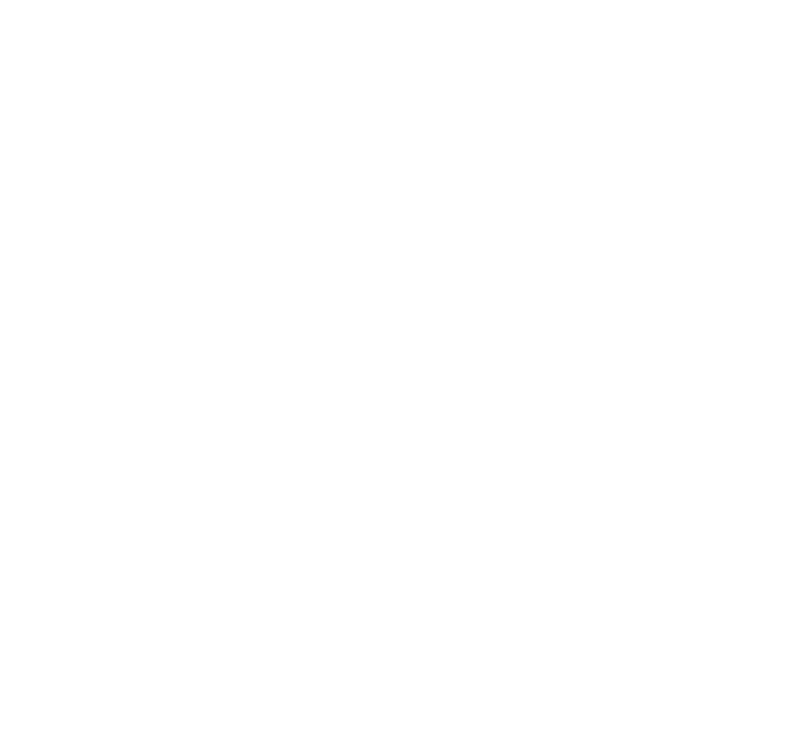
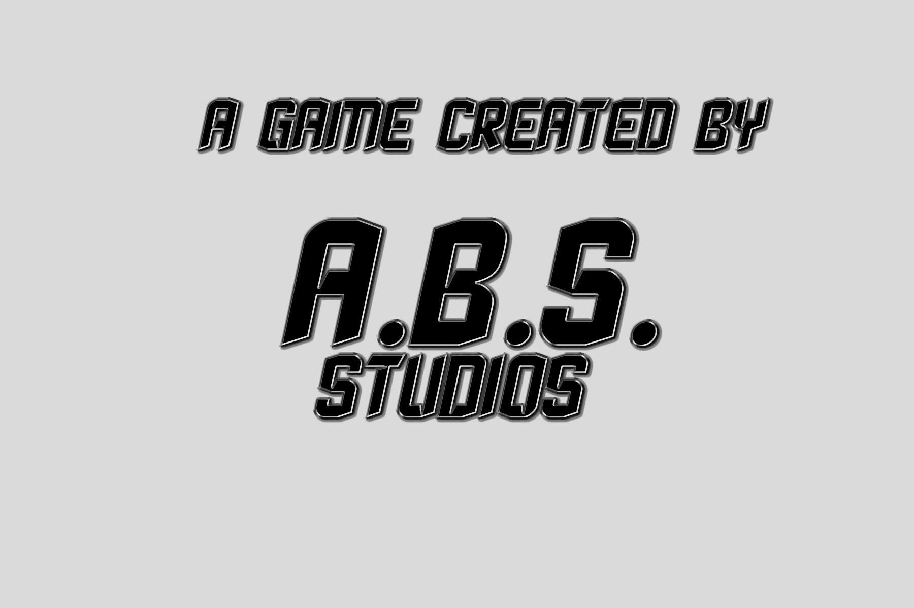

# Toofia_Version_0.26.35
 The main repo for the game

**Game Title:** *Toofia: Kasangkapang Tulong Pang-edukasyon*

**Language Used:** *Pure GDScript*

**Progress:** *45% out of 100%*

**Completed Goal:**
- [x] Add a Persistent Music system that persists even when restarting the game.
- [x] Added Name Input and store it locally
- [x] Added 1 Level with Two Questions
- [x] Added, Modified and Fixed the Reapeat Button of the Question by pressing the image
- [x] Add the Blocks of Time's level selection
- [  ] 
- [  ]
- [  ]
- [  ]
- 
**Next Goal:**
- [  ] Add a system logic that makes the star display 1, 2 or 3 stars based on the players choice
- [  ] Implement this system to other levels :face_with_spiral_eyes:
- [  ] Add more questions to Levels :dizzy_face:
- [  ] TLDR;
- [  ] Finish the game.. :tada:
- more to come...

 

**Download the Source File**
- Download [Here](https://github.com/Moggle-Khraum/Toofia_Version_0.26.35/archive/refs/heads/main.zip)

    <b> The Toofia Game's Icon:</b> &emsp; &emsp; &emsp; &emsp; &emsp; &emsp; <b> Made with Godot Engine</b> 
     &emsp; &emsp; &emsp; &emsp; &emsp;  &emsp; &emsp; &emsp; &emsp; &emsp; 
     

    
